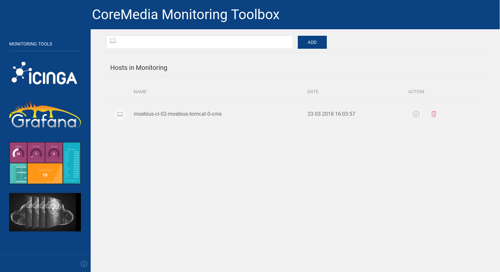

# CoreMedia Monitoring Toolbox

#### Table of Contents

1. [About][About]
2. [Installation][Installation]
3. [Publications][publications]
4. [License][License]
5. [Contributing][Contributing]

## About

The Monitoring Toolbox is a set of monitoring tools that monitors the availability of CoreMedia resources and can generate performance data for reporting.
This data is made available as graphs and congestion changes.

It provides a simple web frontend to manage hosts.

## Installation

For installing please check the [Quick start](doc/de/02-getting-started.md) in the documentation.
Sorry, currently only available in german.

## Publications

Officially the stack was presented at the [OSMC](https://osmc.de/archive-2017/) (the worldwide leading conference focused on open source monitoring solutions).

The talk was published on [YouTube](https://www.youtube.com/watch?v=FIzXuLlynQE)

## License

The Monitoring Toolbox are licensed under the term of the CoreMedia Open Source License.
You will find a copy of this license in the LICENSE.md file included in the source package.

## Contributing

There are many ways to contribute to Monitoring Toolbox -- whether it be sending patches,
testing, reporting bugs, or reviewing and updating the documentation.

**Every contribution is appreciated!**

Please continue reading in the [contributing chapter](CONTRIBUTING.md).

<!-- TOC URLs -->
[About]: #about
[License]: #license
[Installation]: #installation
[Contributing]: #contributing
[Publications]: #publications

