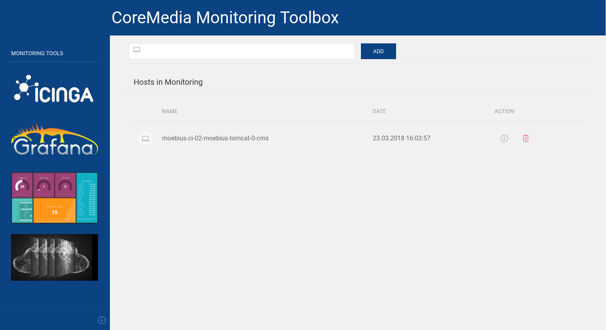

# Erste Schritte <a id="getting-started"></a>

## Einleitung

In diesem kurzen Tutorial geht es darum einen Monitoring-Stack in möglichst kurzer Zeit zu starten.
Es wird davon ausgegangen, dass man mit dem jeweiligen Betriebssystem vertraut ist und Tools wie z.B.
Docker kennt und benutzen kann.

Als Basissystem dient ein Linux (Debian/CentOS). MacOS bzw. Windows sollten ähnlich sein.


## Installation

### Docker-Engine

Der Monitoring-Stack sollte mit jeder Docker Version > 18.01 funktionieren.
Wir empfehlen aber mindestens Version 18.03.

Die Installation sollte über die Boardmittel des Betriebssystemes erfolgen.


**Debian**

```bash
$ sudo apt-get -y remove docker docker-engine
$ sudo apt-get install -y apt-transport-https ca-certificates curl python-software-properties
$ sudo curl -fsSL https://download.docker.com/linux/debian/gpg | sudo apt-key add -
$ sudo add-apt-repository "deb [arch=amd64] https://download.docker.com/linux/debian $(lsb_release -cs) stable"
$ sudo apt-get update
$ sudo apt-get install -y docker-ce
```

*Kurzerklärung der einzelnen Schritte*

Entfernen einer ggf. alten installation:
`sudo apt-get -y remove docker docker-engine`

Ermöglicht den Zugriff auf das Docker-Repository um die benötigen Pakete zu installieren:
`sudo apt-get install -y apt-transport-https ca-certificates curl python-software-properties`

Fügt den offiziellen GPG-Schlüssel von Docker hinzu:
`sudo curl -fsSL https://download.docker.com/linux/debian/gpg | sudo apt-key add -`

Integriert den stabilen Repositoryzweig von Docker in die Packetverwaltung:
`sudo add-apt-repository "deb [arch=amd64] https://download.docker.com/linux/debian $(lsb_release -cs) stable"`

Aktuallisiert den lokalen Packetindex:
`sudo apt-get update`

Installiert die aktuelle Version der Docker Community Edition:
`sudo apt-get install -y docker-ce`


**CentOS**

```bash
$ yum remove docker docker-common container-selinux docker-selinux docker-engine
$ yum install -y yum-utils
$ yum-config-manager --add-repo https://download.docker.com/linux/centos/docker-ce.repo
$ yum makecache fast
$ yum install docker-ce
```

**MacOS**

Für MacOS gibt es eine eigene [Installationsanleitung](https://hub.docker.com/editions/community/docker-ce-desktop-mac).


**Windows**

Für Windows gibt es eine eigene [Installationsanleitung](https://hub.docker.com/editions/community/docker-ce-desktop-windows)


### Docker-Compose

Neben dem eigentlichen `docker` benötigen wir noch das `docker-compose` binary, welches uns eine einfach Möglichkeit bietet,
viele Container einfach zu orchestrieren.

```bash
$ COMPOSE_VERSION="1.16.1"
$ URL="https://github.com/docker/compose/releases/download/${COMPOSE_VERSION}/docker-compose-$(uname -s)-$(uname -m)"
$ curl -L ${URL} > /usr/bin/docker-compose_${COMPOSE_VERSION}
$ ln -s /usr/bin/docker-compose_${COMPOSE_VERSION} /usr/bin/docker-compose
```

### docker user erstellen

Anschließend sollte der lokale User noch Zugriff auf den entsprechenden Service bekommen.

Dazu fügen wir die entsprechenden User zur Grupper `docker` hinzu:

```bash
$ groupadd docker
$ usermod -aG docker $USER
```

Nach einer Neuanmeldung (bzw. einen Neustart) sollte jetzt ein Zugriff auf `docker` und `docker-compose` möglich sein

```bash
$ docker --version
Docker version 18.06.1-ce, build e68fc7a

$ docker-compose --version
docker-compose version 1.16.1
```

Damit wäre die Basisvoraussetzung erfüllt.


## Monitoring-Toolbox

```bash
$ cd ~
$ git clone https://github.com/CoreMedia/monitoring.git cm-monitoring-toolbox
```

Nach dem erfolgreichen clonen sollte **ungefähr** diese Verzeichnissstruktur vorhanden sein:

```bash
cm-monitoring-toolbox
  ├── docker-cm-carbon-client
  ├── docker-cm-dashing
  ├── docker-cm-data
  ├── docker-cm-data-collector
  ├── docker-cm-grafana-client
  ├── docker-cm-icinga2
  ├── docker-cm-icinga-client
  ├── docker-cm-jolokia
  ├── docker-cm-rest-service
  ├── docker-cm-service-discovery
  ├── docker-documentation
  ├── environments
  │    ├── aio
  │    │    ├── ssl
  │    │    ├── docker-compose.yml
  │    │    └── environments.yml
  │    ├── config
  │    ├── data-capture
  │    └── data-visualization
  │
  └── go-cm-portscanner
```

Alle Verzeichnisse, die mit `docker-cm` beginnen, beinhalten die komplette CoreMedia Logik bezüglich des Monitorings,
oder sind spezielle Clients für OpenSource Komponenten.


Im Verzeichniss `environments` befinden sich 3 verschieden Monitoringumgebungen:

  * `aio` (All-In-One) - beinhaltet die komplette Toolbox.<br>
   Diese kann auf einem Notebook, einem lokalen Rechner oder aber (idealerweise) auf einem dezidiertem Server installiert werden und bietet die geringsten Einstiegshürden.<br>
   Dies ist die Basis für den folgenden Schnelleinstieg.
  * `data-capture` - beinhaltet alle Services um Daten zu erfassen und an externe Services weiterzuleiten.
  * `data-visualization` - beinhaltet alle Services um Monitoringdaten zu visualisieren.

Um den Startvorgang zu beschleunigen, werden pre-compiled OpenSource Container von [Docker Hub](https://hub.docker.com/r/bodsch/) benutzt.


### SSL Zertifikat erstellen

Seit Version *1802* unterstützt die Toolbox HTTPS.

Per default ist die Unterstützung aktiviert, es muß daher nur noch ein gültiges Zertifikat in den `nginx` Container kopiert werden.

Je nach Umgebung müssen in das jeweilige `ssl` Verzeichniss folgende Dateien hinterlegt werden:

- `cert.pem`
- `key.pem`
- `dh.pem`

Für Testzwecke kann man sich ein eigenes, selbst-signiertes, Zertifikat erstellen, welches anschließend im Browser manuell bestätigt werden muß.

Bei der folgenden Eingabeaufforderung ist die wichtigste Zeile ist diejenige, die den **`Common Name`** anfordert.

Hier muss der Domainname eingeben werden, der dem jeweiligen Rechner zugeordnet ist.

Wer sich unsicher ist, ruft auf der Kommandozeile `hostname -f` auf:

```bash
$ hostname -f
dunkelzahn.matrix.lan
```
oder nutzt einfach `localhost`.


```bash
$ cd ~/monitoring
$ openssl req -x509 -nodes -days 365 -newkey rsa:2048 -keyout ~/cm-monitoring-toolbox/aio/ssl/key.pem -out ~/cm-monitoring-toolbox/aio/ssl/cert.pem

Generating a 2048 bit RSA private key
.....+++
..........................................+++
writing new private key to 'ssl/key.pem'
-----
You are about to be asked to enter information that will be incorporated
into your certificate request.
What you are about to enter is what is called a Distinguished Name or a DN.
There are quite a few fields but you can leave some blank
For some fields there will be a default value,
If you enter '.', the field will be left blank.
-----
Country Name (2 letter code) [AU]:DE
State or Province Name (full name) [Some-State]:Hamburg
Locality Name (eg, city) []:Hamburg
Organization Name (eg, company) [Internet Widgits Pty Ltd]:
Organizational Unit Name (eg, section) []:
Common Name (e.g. server FQDN or YOUR name) []:localhost
Email Address []:
```

Anschließend erstellen wir noch eine Diffie-Hellman Gruppe um `Perfect Forward Secrecy` zu aktivieren:

```bash
$ openssl dhparam -out ~/cm-monitoring-toolbox/aio/ssl/dh.pem 2048
Generating DH parameters, 2048 bit long safe prime, generator 2
This is going to take a long time
....................................
```

## <a name="first-run"></a>erster Start

Vor dem ersten Start müssen wir in das gewünschte Environment wechseln

```bash
$ cd ~/cm-monitoring-toolbox/monitoring/environments/aio
$ ls -1a
  docker-compose.yml
  .env
  Makefile
  ssl
```

Die Datei `docker-compose.yml` beinhaltet eine kleine Orchestrierung der benötigten Container, die der Stack bereitstellen wird.
In der Datei `.env` sind Environment Variablen hinterlegt, die durch die compose Datei eingelesen werden.
Das könnten z.B. Passwörter sein, die man individuell erstellt.
Im Verzeichniss `ssl` sind die vorhin erzeugten Zertifikate hinterlegt.

Für den folgenden Test muß man diese Dateien nicht ändern, sie laufen *out-of-the-box*.

Der Stack setzt sich aus bereits erstellten Containern (wie z.B. `docker-grafana`) und  noch zu bauenden Conatinern (z.B. `docker-cm-rest-service`) zusammen.

Eine kurze Zusammenfassung bzgl. `docker-compose` kann man in einem extra [Artikel](10-docker-compose.md) nachlesen.

Die Monitoring-Toolbox lässt sich jetzt mit einem einfachen `docker-compose up --build -d` starten.


Nachdem der build und der start abgeschlossen sind, kann man das Ergebniss kurz validieren

```bash
docker-compose ps

       Name                      Command               State                                            Ports
------------------------------------------------------------------------------------------------------------------------------------------------------
beanstalkd            /usr/bin/beanstalkd -b /va ...   Up      11300/tcp
carbon                /init/run.sh                     Up      0.0.0.0:2003->2003/tcp, 0.0.0.0:2003->2003/udp, 2004/tcp, 7002/tcp, 7003/tcp, 7007/tcp, 8080/tcp
cm-carbon-client      /usr/local/bin/carbon-data.rb    Up
cm-dashing            /init/run.sh                     Up      3030/tcp
cm-data-collector     /usr/local/bin/data-collec ...   Up
cm-grafana-client     /usr/local/bin/grafana-cli ...   Up
cm-icinga-client      /init/run.sh /usr/local/bi ...   Up
cm-icinga2-master     /init/run.sh                     Up      0.0.0.0:5665->5665/tcp, 0.0.0.0:32791->8080/tcp
cm-rest-service       /init/run.sh                     Up
cm-service-discover   /usr/local/bin/service-dis ...   Up
database              /init/run.sh                     Up      3306/tcp
grafana               /init/run.sh                     Up      3000/tcp
graphite              /init/run.sh                     Up      2003/tcp, 2003/udp, 7002/tcp, 8080/tcp
icingaweb2            /init/run.sh                     Up      80/tcp
jolokia               /init/run.sh                     Up      22222/tcp, 0.0.0.0:8080->8080/tcp, 0.0.0.0:8088->8088/tcp
markdown-service      /srv/ruby-markdown-service ...   Up      2222/tcp
memcached             docker-entrypoint.sh --lis ...   Up      11211/tcp
nginx                 /init/run.sh /usr/sbin/nginx     Up      0.0.0.0:443->443/tcp, 0.0.0.0:80->80/tcp
redis                 /usr/bin/redis-server /etc ...   Up      6379/tcp
```

Beim Start werden alle Abhängigkeiten aus dem Internet geladen, so lange das noch nicht geschehen ist.
Das betrifft vor allem alle OpenSource Container, die bereits vorab gebaut wurden und auf `https://hub.docker.com` zum Download vorliegen.

Die CoreMedia Container werden - so lange sie nicht in einer privaten Registry gespeichert werden - gebaut.
Beim ersten Start kann dies bis zu 7 Minuten dauern. Abhängig von der Internetanbindung und der Hardwareausstattung.

Nach dem erfolgreichem Start steht das Webinterface der Toolbox unter `http://localhost` zur Verfügung:




### Beispiele

Ich möchte hier noch ein paar Beispiele aufführen um den Einstieg zu erleichtern.

Dazu versuche ich auf mehrere Szenarien einzugehen.

**WICHTIG**
Wir benötigen generell eine funktionierende DNS Auflösung!


#### Blueprint-Box / Hinzufügen einer CoreMedia Node

In einer Blueprint-Box laufen in der Regel alle Services und sie sollte unter den nahmen `blueprint-box` erreichbar sein.
In der Standardkonfiguration hat diese zum Beispiel die IP `192.168.252.100`.


In der `docker-compose.yml` Datei wurde bereits für Blueprint-Box ein seperater hosts Eintrag vorbereitet:

```bash

  cm-service-discovery:
    ...
    extra_hosts:
      osmc.local: 192.168.122.60
      blueprint-box: 192.168.252.100
```

Damit kann diese aus den Containern heraus erreicht werden.

Im Webfrontend kann man nun den FQDN, oder die jeweilige IP des zu überwachenden Hosts eingeben.

Daraufhin wird die [Service Discovery](./20-service-discovery.md) versuchen festzustellen, welche CoreMedia Services dort laufen und diese in das Monitoring aufnehmen.

Das Webinterface bietet nur einen Bruchteil der Möglichkeiten. Über die [API](./30-api.md) hat man deutlich mehr Möglichkeiten.

Wir haben ein paar [Screenshots](./90-screenshots.md) hinzugefügt um zu zeigen, was zur Zeit alles möglich ist.
