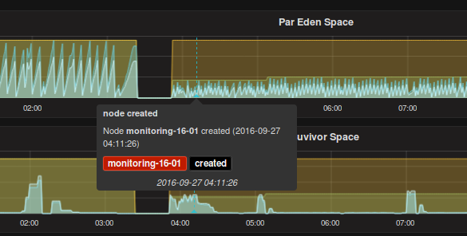

REST API
========

Wir haben versucht, möglichst alles über eine einfach API aufrufbar zu bekommen.

## Beschreibung

Our Monitoring provides an simplyfied API to create and destroy Nodes for Monitoring.
This API helps also to create Annotations and give back Informations about all known Hosts

Unser Monitoring stellt eine einfachte API zur Verfügung, um für Hosts und deren Services ein Monitoringzur Verfügung zu stellen.
Diese API hilft ebenso bei der Erstellung von Annotationen und gibt Informationen über alle bekannten Hosts zurück.

## Beispiele

## Hilfe

```bash
curl http://localhost/api/v2/help
```

---

## Hosts

### einen Host in das Monitoring integrieren

Das hinzufügen wird über einen `POST` Request ermöglicht. Hierbei kann über `--data` json formatierte Parameter mitgegeben werden:

Aktuell funktionieren folgende Paramaeter:

| Parameter    | Typ     | default | Beschreibung |
| :---------   | :-----: | :------ | :----------- |
| `force`      | bool    | `false` | wenn `true` gesetzt ist, werden alle vorher gefundenen Informationen über die Node gelöscht |
| `tags`       | Array   | `[]`    | Eine Liste von Tags, die an die Node in Grafana gehängt werden |
| `config`     | Hash    | `{}`    | Ein Hash für das direkte schreiben einer Konfiguration |

Unterhalb von `config` stehen weitere Parameter zur Verfügung:

| Parameter             | Typ     | default       | Beschreibung | Beispiel |
| :---------            | :-----: | :-----        | :----------- | :------- |
| `graphite-identifier` | String  | `${HOSTNAME}` | Ändert den Identifier für die Kombination `graphite` / `grafana`<br>dadurch ist es möglich in einer sehr dynamischen Umgebung (z.B. Amazon Web Services) einen einheitlichen Identifier für das Graphensystem zu nutzen | `"graphite-identifier": "development-system"` |
|                       |         |               |                                                                                                                     | |
| `ports`               | Array   | `[]`          | **ersetzt** den intern genutzten Portbereich<br>hierdurch kann man gezielt individuelle Ports durch das Monitoring nutzen.                                                                        | `"ports": [50199,51099]` |
|                       |         |               |                                                                                                                     | |
| `display-name`        | String  | `${HOSTNAME}` | ändert den Anzeige Namen im Grafana.<br>dadurch kann man individuelle Namen nutzen                                                                                | `"display-name": "foo.bar.com"` |
|                       |         |               |                                                                                                                     | |
| `services`            | Array   | `[]`          | **ergänzt** die Services, die durch die Service Discovery gefunden werden.<br>dadurch ist es möglich den Server **vor** den Starten der Services in das Monitoring zu integrieren bzw. einen Service mit langer Startzeit oder größeren Abhängigkeiten vorzugeben. | `"services": ["cae-live","content-managment-server"]` |
|                       |         |               |                                                                                                                     | |
| `group_by`            | Array   | `[]`          | über die `group_by` Regel kann über mehrere Host ein *Overview* Dashboard erstellt werden<br>**ACHTUNG** dabei wird das Host eigene Overview Dashboard nicht mehr erstellt. | |
|                       |         |               |                                                                                                                     | |

**Beispiele eines Parametersatzes**

```bash
{
  "force": true,
}
```


```bash
{
  "force": true,
  "tags": [
    "development",
    "git-0000000"
  ],
  "config": {
    "graphite-identifier": "development-system",
    "ports": [50199,51099],
    "display-name": "foo.bar.com",
    "services": ["cae-live","content-managment-server"]
  }
}
```

```bash
{
  "force": true,
  "tags": [
    "development",
    "git-0000000"
  ],
  "config": {
    "graphite-identifier": "development-system",
    "ports": [50199,51099],
    "group_by": ["managment"],
    "display-name": "foo.bar.com"
  }
}
```


#### kompletter Aufruf
```bash
HOSTNAME=blueprintbox.local

curl \
  --silent \
  --request POST \
  --data '{ "force": true }' \
  http://localhost/api/v2/host/${HOSTNAME} | \
  json_reformat

{
  "status": 200,
  "message": "the message queue is informed ..."
}
```

### entfernen eines Hosts aus dem Monitoring

Das löschen einer Node wird über ein `DELETE` ermöglicht.


#### kompletter Aufruf
```bash
HOSTNAME=blueprintbox.local

curl \
  --silent \
  --request DELETE \
  http://localhost/api/v2/host/${HOSTNAME} | \
  json_reformat
```

---

# Information über einen Host im Monitoring

Informationen über die Nodes des Monitorings bekommt man über ein `GET` zurückgeliefert.
Hierbei gibt es 3 Möglichkeiten:

* ohne Parameter:
```bash
curl \
  --silent \
  --request GET \
  http://localhost/api/v2/host | \
  json_reformat
```

* ohne Parameter:
```bash
curl \
  --silent \
  --request GET \
  http://localhost/api/v2/host?short | \
  json_reformat
```

* mit Parameter:
```bash
HOSTNAME=blueprintbox.local

curl \
  --silent \
  --request GET \
  http://localhost/api/v2/host/${HOSTNAME}

{
  "blueprintbox.local": {
    "dns": {
      "ip": "192.168.252.100",
      "short": "blueprintbox",
      "fqdn": "blueprintbox.local"
    },
    "status": {
      "created": "2018-01-05 11:35:29 +0000",
      "status": "online"
    },
    "custom_config": {
      "ports": [
        40899,
        40799
      ]
    },
    "services": {
      "caefeeder-live": {
        "port": 40899,
        "description": "CAEFeeder Live",
        "feeder": "live",
        "cap_connection": true,
        "uapi_cache": true,
        "heap_cache": true
      },
      "caefeeder-preview": {
        "port": 40799,
        "description": "CAEFeeder Preview",
        "feeder": "preview",
        "cap_connection": true,
        "uapi_cache": true,
        "heap_cache": true
      }
    }
  },
  "status": 200
}
```

---

# Grafana Annotations

Annotationen bieten eine Möglichkeit, Messpunkte in einem Graphen mit einem Ereignissen zu markieren bzw. anzureichern.

Zu diesem Zweck haben wir 4 Arten von üblichen Annotationen fest integriert:

* das erstellen einer Node (`create`)
* das entfernen einer Node (`destroy`)
* Lasttestest (`loadtest`)
* Deployments (`deployment`)

Die Annotation `create` wird dabei automatisch beim aufnehmen eines Hosts in das Monitoring erstellt.
Beim entfernen des Hosts, wird automatisch eine `destroy` Annotation erstellt.

### Ausnahme
Wird `"force": true` gesetzt, werden keine Annotations geschrieben!


Zu jedem dieser Annotationen ist es möglich, über `--data` json formatierte Parameter dem REST Aufruf mitzugeben:

* **`create`**

```bash
HOSTNAME=blueprintbox.local

curl \
  --silent \
  --request POST \
  --data '{ "command": "create" }' \
  http://localhost/api/v2/annotation/${HOSTNAME} | \
  json_reformat
```

* **`destroy`**

```bash
HOSTNAME=blueprintbox.local

curl \
  --silent \
  --request POST \
  --data '{ "command": "destroy" }' \
  http://localhost/api/v2/annotation/${HOSTNAME} | \
  json_reformat
```

* **`loadtest`**

```bash
HOSTNAME=blueprintbox.local

curl \
  --silent \
  --request POST \
  --data '{ "command": "loadtest", "argument": "start" }' \
  http://localhost/api/v2/annotation/${HOSTNAME} | \
  json_reformat


curl \
  --silent \
  --request POST \
  --data '{ "command": "loadtest", "argument": "stop" }' \
  http://localhost/api/v2/annotation/${HOSTNAME} | \
  json_reformat
```

* **`deployment`**

```bash
HOSTNAME=blueprintbox.local

curl \
  --silent \
  --request POST \
  --data '{ "command": "deployment", "message": "version 7.1.50", "tags": ["7.1.50"] }' \
  http://localhost/api/v2/annotation/${HOSTNAME} | \
  json_reformat
```


Für diese Annotation Typen wurden in den von CoreMedia mitgelieferten Templates entsprechende Anzeigemöglichkeiten geschaffen.

