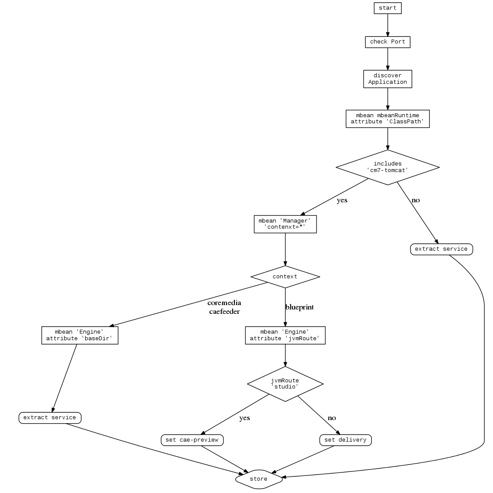

# Service Discovery

Die Service Discovery ist ein kleines Ratespiel.

In älteren CoreMedia Versionen können wir viele Anwendungen auf einem Servlet-Container bereitstellen.
Daher gab es über die verschiedenen Versionen hinweg immer wieder andere Ergebnisse, wenn man über JMX einen Messpunkt abgefragt hatte.
Und (im schlimmsten Fall) kann jeder Kunde die Applikationsnamen ändern.

## Überblick



# request to get data

Beispieldaten, die an jolokia gesendet werden. Wir führen einen *bulk-request* füt 4 verschiedene beans durch.

```
[
  {
    "type": "read",
    "mbean": "java.lang:type=Runtime",
    attribute: ['ClassPath'],
    target: {url: target_url},
    config: {'ignoreErrors' => true, 'ifModifiedSince' => true, 'canonicalNaming' => true}
  },
  {
    "type": "read",
    "mbean": "Catalina:type=Manager,context=*,host=*",
    target: {url: target_url},
    config: {'ignoreErrors' => true, 'ifModifiedSince' => true, 'canonicalNaming' => true}
  },
  {
    "type": "read",
    "mbean": "Catalina:type=Engine",
    "attribute": ["baseDir","jvmRoute"],
    target: {url: target_url},
    config: {'ignoreErrors' => true, 'ifModifiedSince' => true, 'canonicalNaming' => true}
  },
  {
    type: 'read',
    mbean: 'com.coremedia:type=serviceInfo,application=*',
    target: {url: target_url},
    config: {'ignoreErrors' => true, 'ifModifiedSince' => true, 'canonicalNaming' => true}
  }
]
```

Seit der Version 1707 integrieren wir eine separate und schreibgeschützte Bean, die uns bei der sicheren Erkennung von 
Anwendungen hilft.
Diese Bean ist in der `pom.xml` definiert und setzt den Applikationsnamen zur Buildzeit.


# results

## 7.0

*Old Version*

```
[
  {
    "request": {
      "mbean": "java.lang:type=Runtime",
      "attribute": "ClassPath",
      "type": "read",
      "target": {
        "url": "service:jmx:rmi:///jndi/rmi://192.168.252.170.xip.io:40099/jmxrmi"
      }
    },
    "value": {
      "ClassPath": "/opt/coremedia/cm7-tomcat-installation/bin/bootstrap.jar:/opt/coremedia/cm7-tomcat-installation/bin/tomcat-juli.jar"
    },
    "timestamp": 1483716539,
    "status": 200
  },
  {
    "request": {
      "mbean": "Catalina:context=*,host=*,type=Manager",
      "type": "read",
      "target": {
        "url": "service:jmx:rmi:///jndi/rmi://192.168.252.170.xip.io:40099/jmxrmi"
      }
    },
    "value": {
      "Catalina:context=/blueprint,host=localhost,type=Manager": {},
      "Catalina:context=/manager,host=localhost,type=Manager": {},
      "Catalina:context=/editor-webstart,host=localhost,type=Manager": {},
      "Catalina:context=/webdav,host=localhost,type=Manager": {},
      "Catalina:context=/studio,host=localhost,type=Manager": {},
      "Catalina:context=/elastic-worker,host=localhost,type=Manager": {}
    },
    "timestamp": 1483716539,
    "status": 200
  },
  {
    "request": {
      "mbean": "Catalina:type=Engine",
      "attribute": [
        "baseDir",
        "jvmRoute"
      ],
      "type": "read",
      "target": {
        "url": "service:jmx:rmi:///jndi/rmi://192.168.252.170.xip.io:40099/jmxrmi"
      }
    },
    "value": {
      "baseDir": "/opt/coremedia/cm7-studio-tomcat",
      "jvmRoute": "studioWorker"
    },
    "timestamp": 1483716539,
    "status": 200
  }
]
```
Im ersten Block (`"mbean": "java.lang:type=Runtime"`) schauen wir uns die `"ClassPath"` Variable an.
Enthält dieser ein `cm7-tomcat-installation` gehen wir davon aus, dass es sich dabei um ein CoreMedia 7.0 System handelt.

Anschließend schauen wir in den zweiten Block (`"mbean": "Catalina:context=*,host=*,type=Manager"`) und nutzen den
`"value"` Part.

Jeder Applikation, die in diesem Tomcatläuft, hat ihren eigenen `Catalina:context` Eintrag.

Im Beispiel oben habe wir folgende gefunden:

- blueprint
- manager
- editor-webstart
- webdav
- studio
- elastic-worker

Im dritten Block (`"mbean": "Catalina:type=Engine"`) analysieren wir die beiden Attribute `baseDir` und `jvmRoute`.

Enthält `baseDir` `coremedia` oder `caefeeder` holen wir den Applikationsnamen vom Pfadnamen.

Enthält `baseDir` `blueprint`, holen wir den Applikationsnamen aus dem `jvmRoute` Attribute.

Enthält `jvmRoute` `studio` dann gehen wir davon aus, dass wir hier eine `cae-preview` vorliegen haben, ansonsten ist es
eine `delivery-cae`

Der `manager` Eintrag wird komplett ignoriert.

Zum Schluß wird der ermittelte Applikationsname normalisiert, damit im späteren Verlauf eine einheitliche Namensgebung ermöglicht wird.


## 7.1

## 7.5

## 17xx

```
[
  {
    "request": {
      "mbean": "java.lang:type=Runtime",
      "attribute": "ClassPath",
      "type": "read",
      "target": {
        "url": "service:jmx:rmi:///jndi/rmi://blueprintbox:42199/jmxrmi"
      }
    },
    "value": {
      "ClassPath": "/opt/coremedia/cae-live-1/current/bin/bootstrap.jar:/opt/coremedia/cae-live-1/current/bin/tomcat-juli.jar"
    },
    "timestamp": 1483365782,
    "status": 200
  },
  {
    "request": {
      "mbean": "Catalina:context=*,host=*,type=Manager",
      "type": "read",
      "target": {
        "url": "service:jmx:rmi:///jndi/rmi://blueprintbox:42199/jmxrmi"
      }
    },
    "value": {
      "Catalina:context=/blueprint,host=localhost,type=Manager": {

      }
    },
    "timestamp": 1483365782,
    "status": 200
  },
  {
    "request": {
      "mbean": "Catalina:type=Engine",
      "attribute": [
        "baseDir",
        "jvmRoute"
      ],
      "type": "read",
      "target": {
        "url": "service:jmx:rmi:///jndi/rmi://blueprintbox:42199/jmxrmi"
      }
    },
    "value": {
      "baseDir": "/opt/coremedia/cae-live-1/current",
      "jvmRoute": "cae-live-1"
    },
    "timestamp": 1483365782,
    "status": 200
  }
]

```

Im ersten Block (`"mbean": "java.lang:type=Runtime"`) schauen wir uns die `"ClassPath"` Variable an.
Enthält diese **NICHT** `cm7-tomcat-installation` dann wird das neue Portschema genutzt und wir können den Applikationsname
aus dem `ClassPath` extrahieren.

In dieser Version werden multiple Applikationen in einem Tomcat ignoriert.

## 1707 und später


