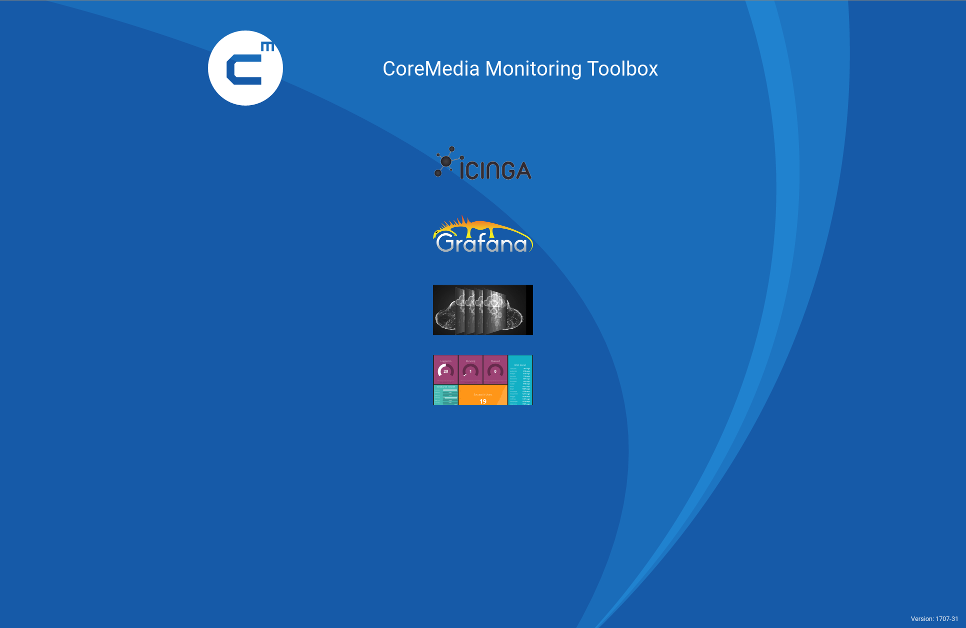

# Schnelleinstieg


In diesem kurzen Kapitel geht es darum einen Monitoring-Stack in möglichst kurzer Zeit zu starten.

Als Basissystem dient ein Linux (Debian/CentOS). MacOS bzw. Windows sollten ähnlich sein.

### Installation

#### Docker-Engine

**Debian**

```bash
apt-get remove \
  docker docker-engine

apt-get install apt-transport-https \
  ca-certificates curl python-software-properties

curl -fsSL https://download.docker.com/linux/debian/gpg | sudo apt-key add -

add-apt-repository \
  "deb [arch=amd64] https://download.docker.com/linux/debian $(lsb_release -cs) stable"

apt-get update

apt-get install docker-ce
```

**CentOS**

```bash
yum remove \
  docker docker-common container-selinux docker-selinux docker-engine

yum install -y \
  yum-utils

yum-config-manager \
  --add-repo \
  https://download.docker.com/linux/centos/docker-ce.repo

yum makecache \
  fast

yum install \
  docker-ce
```


#### Docker-Compose

Neben dem eigentlichen `docker` benötigen wir noch das `docker-compose` binary, welches uns eine einfach Möglichkeit bietet, viele Container einfach zu orchestrieren.

```bash
COMPOSE_VERSION="1.16.1"
URL="https://github.com/docker/compose/releases/download/${COMPOSE_VERSION}/docker-compose-$(uname -s)-$(uname -m)"

curl -L ${URL} > /usr/bin/docker-compose_${COMPOSE_VERSION}

ln -s /usr/bin/docker-compose_${COMPOSE_VERSION} /usr/bin/docker-compose
```

### Post-Installation

#### SSL Zertifikat erstellen

Seit Version *1802* unterstützt die Toolbox HTTPS.

Per default ist die Unterstützung aktiviert, es muß nur noch ein gültiges Zertifikat in den `nginx` Container kopiert werden.

Je nach Umgebung müssen in das Verzeichniss `ssl` folgende Dateien hinterlegt werden:

- `cert.pem`
- `key.pem`
- `dh.pem`

Für Testzwecke kann man sich ein eigenes, selbst-signiertes, Zertifikat erstellen, welches anschließend im Browser bestätigt werden muß.

Bei der folgenden Eingabeaufforderung ist die wichtigste Zeile ist diejenige, die den **`Common Name`** anfordert.

Hier muss der Domainname eingeben werden, der dem jeweiligen Rechner zugeordnet ist (`hostname -f` oder `localhost`).


```bash
$ openssl req -x509 -nodes -days 365 -newkey rsa:2048 -keyout ssl/key.pem -out ssl/cert.pem

Generating a 2048 bit RSA private key
.....+++
..........................................+++
writing new private key to 'ssl/key.pem'
-----
You are about to be asked to enter information that will be incorporated
into your certificate request.
What you are about to enter is what is called a Distinguished Name or a DN.
There are quite a few fields but you can leave some blank
For some fields there will be a default value,
If you enter '.', the field will be left blank.
-----
Country Name (2 letter code) [AU]:DE
State or Province Name (full name) [Some-State]:Hamburg
Locality Name (eg, city) []:Hamburg
Organization Name (eg, company) [Internet Widgits Pty Ltd]:
Organizational Unit Name (eg, section) []:
Common Name (e.g. server FQDN or YOUR name) []:localhost
Email Address []:
```

Anschließend erstellen wir noch eine Diffie-Hellman Gruppe um `Perfect Forward Secrecy` zu aktivieren:

```bash
$ openssl dhparam -out ssl/dh.pem 2048
Generating DH parameters, 2048 bit long safe prime, generator 2
This is going to take a long time
....................................
```


#### docker user erstellen (optional)

Wenn ein spezieller User `docker` benutzen soll, benötigen wir noch eine entsprechende Gruppe und fügen diesen User dier Gruppe hinzu:

```bash
groupadd docker

usermod -aG docker $USER
```

Damit wäre die Basisvoraussetzung erfüllt.

Jetzt benötigen wir noch die

### Monitoring-Toolbox

```bash
cd ~
mkdir cm-monitoring-toolbox
cd cm-monitoring-toolbox

git clone https://github.com/cm-xlabs/monitoring.git
```

Nach dem erfolgreichen clonen sollte **ungefähr** diese Verzeichnissstruktur vorhanden sein:

```bash
monitoring
  ├── bin
  ├── docker-cm-carbon-client
  ├── docker-cm-dashing
  ├── docker-cm-data
  ├── docker-cm-data-collector
  ├── docker-cm-external-discover
  ├── docker-cm-grafana-client
  ├── docker-cm-graphite-client
  ├── docker-cm-icinga2
  ├── docker-cm-icinga-client
  ├── docker-cm-jolokia
  ├── docker-cm-notification-client
  ├── docker-cm-rest-service
  ├── docker-cm-service-discovery
  ├── documentation
  ├── environments
  │    ├── aio
  │    │    ├── docker-compose.yml
  │    │    └── environments.yml
  │    ├── data-capture
  │    └── data-visualization
  │
  └── tools
```

Alle Verzeichnisse, die mit `docker-cm` beginnen, beinhalten die komplette CoreMedia Logik bezüglich des Monitorings,
oder sind spezielle Clients für OpenSource Komponenten.


Im Verzeichniss `environments` befinden sich 3 verschieden Monitoringumgebungen:

  * `aio` (All-In-One) - beinhaltet die komplette Toolbox.
   Diese kann idealerweise auf einem dezidiertem Server oder einem Notebook installiert werden und bietet die geringsten Einstiegshürden.<br>
   Dies ist die Basis für den folgenden Schnelleinstieg.
  * `data-capture` - beinhaltet alle Services um Daten zu erfassen und an externe Services weiterzuleiten.
  * `data-visualization` - beinhaltet alle Services um Monitoringdaten darzustellen.

Um den Startvorgang zu beschleunigen, werden pre-compiled OpenSource Container von [Docker Hub](https://hub.docker.com/r/bodsch/) benutzt.


### erster Start

Vor dem ersten Start müssen wir in das gewünschte Environment wechseln

```bash
cd ~/cm-monitoring-toolbox/monitoring/environments/aio
ls -1a
  docker-compose.yml
  .env
  Makefile
  ssl
```

Die Datei `docker-compose.yml` umfasst alle Docker-Container, die der Stack bereitstellen wird.
In `.env` sind einige Environment Variablen hinterlegt, die durch die comose Datei eingelesen werden.
Das könnten z.B. Passwörter sein, die man individuell erstellt.
Beide Dateien muss man nicht ändern, sie laufen *out-of-the-box*.

Im Verzeichniss `ssl` können die oben erwähnten Zertifikate hinterlegt werden.

Die Monitoring-Toolbox lässt sich jetzt mit einem einfachen `docker-compose up --build -d` starten.

Wenn der build und der start abgeschlossen sind, kann man das Ergebniss kurz validieren

```bash
docker-compose ps

       Name                      Command               State                                            Ports
------------------------------------------------------------------------------------------------------------------------------------------------------
beanstalkd            /usr/bin/beanstalkd -b /va ...   Up      11300/tcp
carbon                /init/run.sh                     Up      0.0.0.0:2003->2003/tcp, 0.0.0.0:2003->2003/udp, 2004/tcp, 7002/tcp, 7003/tcp, 7007/tcp, 8080/tcp
cm-carbon-client      /usr/local/bin/carbon-data.rb    Up
cm-dashing            /init/run.sh                     Up      3030/tcp
cm-data-collector     /usr/local/bin/data-collec ...   Up
cm-grafana-client     /usr/local/bin/grafana-cli ...   Up
cm-icinga-client      /init/run.sh /usr/local/bi ...   Up
cm-icinga2-master     /init/run.sh                     Up      0.0.0.0:5665->5665/tcp, 0.0.0.0:32791->8080/tcp
cm-rest-service       /init/run.sh                     Up
cm-service-discover   /usr/local/bin/service-dis ...   Up
database              /init/run.sh                     Up      3306/tcp
grafana               /init/run.sh                     Up      3000/tcp
graphite              /init/run.sh                     Up      2003/tcp, 2003/udp, 7002/tcp, 8080/tcp
icingaweb2            /init/run.sh                     Up      80/tcp
jolokia               /init/run.sh                     Up      22222/tcp, 0.0.0.0:8080->8080/tcp, 0.0.0.0:8088->8088/tcp
markdown-service      /srv/ruby-markdown-service ...   Up      2222/tcp
memcached             docker-entrypoint.sh --lis ...   Up      11211/tcp
nginx                 /init/run.sh /usr/sbin/nginx     Up      0.0.0.0:443->443/tcp, 0.0.0.0:80->80/tcp
redis                 /usr/bin/redis-server /etc ...   Up      6379/tcp
```

Dabei werden alle Abhängigkeiten aus dem Internet geladen (das betrifft alle OpenSource Container, die bereits vorab gebaut wurden und auf `https://hub.docker.com` zum Download vorliegen)
und die CoreMedia Container werden anschließend gebaut. Beim ersten Start kann dies bis zu 5 Minuten dauern. Abhängig von der Internetanbindung und der Hardwareausstattung.

Nach dem erfolgreichem Start steht das Webinterface der Toolbox unter `http://localhost` zur Verfügung:




### Beispiele

Ich möchte hier noch ein paar Beispiele aufführen um den Einstieg zu erleichtern.

Dazu versuche ich auf mehrere Szenarien einzugehen.

**WICHTIG**
Wir benötigen generell eine funktionierende DNS Auflösung!

Bei Problemen siehe dazu(./documentation/troubleshooting.md#DNS)


#### Blueprint-Box / Hinzufügen einer CoreMedia Node

In einer Blueprint-Box laufen in der Regel alle Services und sie sollte unter den nahmen `blueprint-box` erreichbar sein.
In der Standardkonfiguration hat diese zum Beispiel die IP `192.168.252.100`.

Die Monitoring-Toolbox wurde wie oben beschrieben erfolgreich gestartet und steht zur Verfügung.

Das REST-Interface kann man kurz testen:

```bash
# > curl http://localhost/api/

CoreMedia Monitoring API - v2 (Version 1709)

Short description of the REST API
```

Da sich alle Services auf einer Box befinden, werden keine weiteren Angaben über die API benötigt und man kann den schnellen Weg nutzen

```bash
# > curl --request POST http://localhost/api/v2/host/blueprint-box
{
  "blueprint-box": {
  },
  "status": 200,
  "message": "the message queue is informed ..."
}
```
Nach einiger Zeit kann man sich das Ergebniss ansehen

```bash
# > curl http://localhost/api/v2/host/blueprint-box
{
  "blueprint-box": {
    "dns": {
      "ip": "192.168.252.100",
      "short": "blueprint-box",
      "fqdn": "blueprint-box"
    },
    "status": {
      "created": "2017-09-28 09:57:52 +0000",
      "status": "online"
    },
    "services": {
      .
      .
      .
    }
  }
}
```

Auf Grund der Entkopplung von REST-Interface zu den Backendservices wie Grafana und Icinga, kann es unter Umständen bis zu 2 Minuten dauern, bis visuelle Ergebnisse zur Verfügung stehen.


#### Blueprint-Box / Hinzufügen eines einzelnen Services (content-management-server)

Um einen eizelnen Service in das Monitoring auzunehmen, muß man nur den Portbereich eingrenzen, der durch die ServiceDiscovery abgefragt wird.

```bash
# > curl --request POST http://localhost/api/v2/host/blueprint-box --data '{"config":{"ports": [40199]}}'
{
  "blueprint-box": {
    "request": {
      "config": {
        "ports": [
          40199
        ]
      }
    }
  },
  "status": 200,
  "message": "the message queue is informed ..."
}
```
Ein kurzer Blick in das REST-Interface zeigt uns, dass auch nur der Content Server ins Monitoring aufgenommen wurde:

```bash
# > curl --request GET http://localhost/api/v2/host/blueprint-box
{
  "blueprint-box": {
    "dns": {
      "ip": "192.168.252.100",
      "short": "blueprint-box",
      "fqdn": "blueprint-box"
    },
    "status": {
      "created": "2017-09-28 10:35:45 +0000",
      "status": "online"
    },
    "custom_config": {
      "ports": [
        40199
      ]
    },
    "services": {
      "content-management-server": {
        "port": 40199,
        "description": "ContentServer CMS",
        "port_http": 40180,
        "ior": true,
        "runlevel": true,
        "license": true,
        "heap_cache": true
      }
    }
  },
  "status": 200
}
```

#### Blueprint-Box / Erweiterung der Service Discovery um den Replication Live Server

Wenn man in einer Continous Integration arbeitet, kann es vorkommen, dass man einen Host möglichst frühzeitig in das Monitoring integrieren möchte.
Zum Start des Hosts stehen aber entweder noch nicht alle Services zur Verfügung - z.B. aufgrund längerer Startzeiten - oder aber das Deployment ist zu dem Zeitpunkt noch gar nicht gestartet.
Von einer anderen Seite betrachtet, kann es aber auch sein, dass man einen weiteren Service ausrollen möchte, der nicht zu der Hostkonfiguration passt und
trotz alledem ein Monitoring etablieren möchte.
Zu diesem Zweck kann man in dem Request für das REST-Interface eine Liste von Services mitgeben, die man erwartet, aber (z.B.) zeitversetzt starten.

In unserem Beispiel fügen wir explizit den Replication Live Server zu unserer Service Discovery hinzu.

```bash
# > curl --request POST http://localhost/api/v2/host/blueprint-box --data '{"config":{"services": ["replication-live-server"]}}'
{
  "blueprint-box": {
    "request": {
      "config": {
        "services": [
          "replication-live-server"
        ]
      }
    }
  },
  "status": 200,
  "message": "the message queue is informed ..."
}
```
